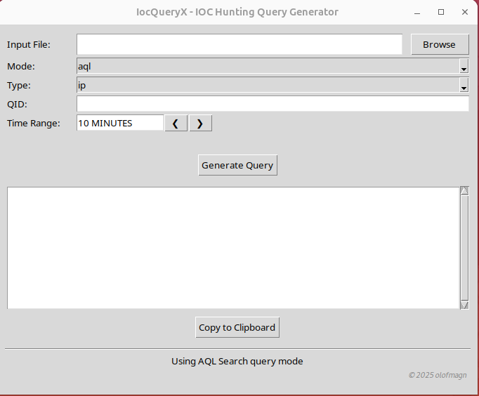
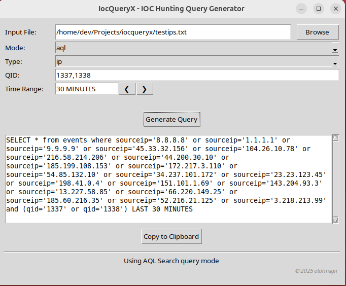

# IocQueryX - IOC Query Generator

A simple python script that generate platform-specific queries (e.g., AQL, Elastic, Defender) from input lists of
IP addresses, domain names, or file hashes to identify first point of contact.

## Features

### Platform-Specific Query Generation

This tool supports generating queries for the following platforms:

- AQL (IBM QRadar).
- Elastic (ECS).
- Microsoft Defender (KQL).

### Input Support

- Accepts IP addresses.
- Accepts domain names.
- Accepts file hashes.
- Accepts filtering options with `event action`, `qid` and `project` to iterate and navigate data more efficent.

### Flexible Hash Mapping

- Automatically maps hash types to platform-specific field names.
- Supported hash types: `md5`, `sha1` and `sha256`.

### Field mappings

The current field mappings supported by the platform reflect the most commonly used default configurations. However,
depending on your event schema or data mapping, you may need to adjust these mappings manually in
`utils/generate_queries.py`.

```bash
# AQL Platform Field Mappings
AQL_FIELDS = {
    "ip": "sourceip",
    "domain": "\"URL Domain\"",
    "hash": {
        "filehash": "\"File Hash\"",
        "md5": "\"MD5 Hash\"",
        "sha1": "\"SHA1 Hash\"",
        "sha256": "\"SHA256 Hash\""
    }
}

# Elasticsearch Platform Field Mappings
ELASTIC_FIELDS = {
    "ip": "source.ip",
    "domain": "url.domain",
    "hash": {
        "md5": "file.hash.md5",
        "sha1": "file.hash.sha1",
        "sha256": "file.hash.sha256"
    }
}

# Microsoft Defender Platform Configuration
DEFENDER_FIELDS = {
    "ip": {
        "field": "RemoteIP",
        "table": "DeviceNetworkEvents"
    },
    "domain": {
        "field": "RemoteUrl",
        "table": "DeviceNetworkEvents"
    },
    "hash": {
        "table": "DeviceFileEvents",
        "fields": {
            "md5": "MD5",
            "sha1": "SHA1",
            "sha256": "SHA256"
        }
    }
}

    base_fields = ["Timestamp", "DeviceName"]
    
    field_mappings = {
        "ip": base_fields + ["RemoteIP", "AccountName", "InitiatingProcessAccountName",
                             "InitiatingProcessAccountUpn", "IPAddress"],
        "domain": base_fields + ["RemoteUrl", "AccountName", "InitiatingProcessAccountName",
                                 "InitiatingProcessAccountUpn"],
        "hash": base_fields + ["AccountName", "FileName", "InitiatingProcessAccountName",
                               "InitiatingProcessAccountUpn", "FolderPath"]
    }
```

### Filtering Options

#### Qradar AQL:

- `qid` filter.
- `LAST` keyword filter.

#### Elastic (ECS):

- `event.action` filter.
- `@timestamp` filter.

#### Defender

- `base` filter.
- `project` keyword filter.

The values are normally defined by the implementer.

### Easy Input Handling

- Reads all possible files
- Parses only the first field per line (e.g., `ip`, `domain`, or `hash`) using comma-seperated logic.

See example structure below:

```bash
185.200.85.137,443,Sweden --> ip
evil.com, Sweden --> domain
d41d8cd98f00b204e9800998ecf8427e, Sweden --> hash
```

## File structure

```
.
├── LICENSE
├── pictures
│   ├── app-in-use.png
│   └── app.png
├── README.md
├── requirements.txt
├── src
│   ├── gui.py
│   ├── __init__.py
│   └── main.py
├── testips.txt
└── utils
    ├── configuration.py
    ├── generate_queries.py
    ├── __init__.py
    └── ui_constants.py
```

## Requirements

- Python >= 3.0.
- External dependencies as listed in `requirements.txt`.

## Usage

This tool supports two modes of operation:

- **GUI Mode** – Interactive interface for building and generating queries.
- **CLI Mode** – Command-line usage for automation and scripting.

Choose the mode that fits your workflow. Detailed instructions for each are provided below.

### GUI

```python3
python3 - m
src.main
```

```
  ___            ___                       __  __
 |_ _|___   ___ / _ \ _   _  ___ _ __ _   _\ \/ /
  | |/ _ \ / __| | | | | | |/ _ \ '__| | | |\  / 
  | | (_) | (__| |_| | |_| |  __/ |  | |_| |/  \ 
 |___\___/ \___|\__\_\\__,_|\___|_|   \__, /_/\_\
                                      |___/      

Welcome to the application!
Enjoy using the app, and feel free to share any feature requests or feedback!
Version: 1.0.0 olofmagn

? Choose interface mode: (Use arrow keys)
 » GUI
   CLI
   EXIT
```



Example usage of an input file of type: `ip`, mode: `aql` and `qid`.



### CLI
Qradar IBM (IPs)

```python3
python3 -m src.main -i testips.txt -m aql -t ip -q 1337 1338 -l 10m
```

Elastic Query (Hashes):

```python3
python3 -m src.main -i hash.txt -m es -t hash -ht sha1 -ea 1337 1338 -l 10m
```

Defender Query (Domains):

```python3
python3 -m src.main -i domain.txt -m defender -t domain -l 10m -p
```

## License

This project is open-source and licensed under the MIT License. See the LICENSE file for details.
